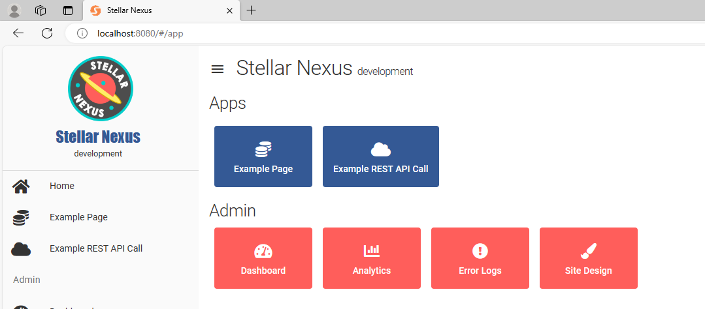

# StellarNexus: Full-Stack Serverless Template 

Powered by [Quasar](https://quasar.dev) as the front-end and [Architect](https://arc.codes) as a serverless backend, StellarNexus aims to make it easy for developers to start building 
a full-stack application. Follow the "New Project Steps" below to setup a new site.

## New Project Steps: 

- Fork this project
- Change `app.arc`
    - @app
- Change `package.json`
    - name 
    - description
- Change `/client/package.json`
    - productName
    - description
- If you don't have a company o365 you can setup an [o365 Developer Tenant](https://developer.microsoft.com/en-us/microsoft-365/dev-program)
- Setup a clientID on the Azure Portal: https://portal.azure.com/#blade/Microsoft_AAD_RegisteredApps/ApplicationsListBlade
    - [Enable "id_token" Auth](https://nishantrana.me/2019/08/27/fix-aadsts700054-response_type-id_token-is-not-enabled-for-the-application-dynamics-365-ce-implicit-grant/)
    - Click on `API Permissions` and setup the required permissions and grant Admin access
    - Change `client/src/services/auth/AuthService.js`
        - clientID
- Change `/client/.env`
    - `APP_NAME` to the name of the project
- Setup AD group for Admin access
    - Update `client/.env`
        - `GLOBAL_ADMIN_GROUP` and `SITE_ADMIN_GROUP`
- Update the Drawer Logos `client/public`
- Go through the **Initial Setup** steps below
- Update the title, logo and description in this readme file
- Remove "New Project Steps" from this readme file

## Pulling Updates From The Template

- https://stackoverflow.com/a/3903835/756623
- From the project root

```
git remote add upstream git@
$ git fetch upstream
$ git checkout master
$ git merge upstream/master
```
## Upgrade to the Latest Versions of Quasar and Architect

- This should be done at the Template and pulled to forked projects
- https://quasar.dev/start/upgrade-guide
- Navigate to `client` and run: `quasar upgrade --install`
- To see if other packages need to be upgraded run: `npm outdated`
    - Then run `npm install --save package@latest` where "package" is the name of the npm package
- TEST EVERYTHING!!!

## Development

### Initial Setup

- Windows: Install [NVM for Windows](https://github.com/coreybutler/nvm-windows)
- Install the version of node that Architect calls for
- Clone the repository
- [Setup AWS](https://arc.codes/docs/en/get-started/detailed-aws-setup)
    - Create a user account in IAM that has `AdministratorAccess`
    - Create an Access Key
    - Navigate to `C:\Users\USER_NAME\.aws\` and edit or create the file `credentials`
    - Add something similar to this:

```
[default]
aws_access_key_id=xxx
aws_secret_access_key=xxx

[work]
aws_access_key_id=xxx
aws_secret_access_key=xxx

[personal]
aws_access_key_id=xxx
aws_secret_access_key=xxx
```

- Install Quasar, Architect and AWS CLI globally
    - `npm i -g @architect/architect aws-sdk @quasar/cli`
- Install dependencies:
    - Run `npm install` from the root of the project
    - Run `npm init @architect` from the root of the project
    - Run `arc hydrate` from the root of the project
        - This command runs `npm install` for each http function (each folder in /src/http)
  	- Run `npm install` in the `client` folder
- Start the client and server for development
    - From the root folder: `npm start`
 - Client is located at http://localhost:8080
 - Server is located at http://localhost:3333

 ### Architect Environment Variables

- Read `ArchitectEnvironmentVariables.md`

### Guidelines

- [Use Semantic commit messages](https://gist.github.com/joshbuchea/6f47e86d2510bce28f8e7f42ae84c716)
    - Example: `Feature: Add awesome new feature`
        - Start with a type
        - Present tense
    - Types used for this project: 
        - `Feature:` 
        - `Fix:` 
        - `Chore:`
        - `Test:`
        - `Refactor:`
        - `Docs:`
        - `Style:`
- Indent using tab size of 2 spaces

### Authorization

- Technology Used
    - Front end
        - [MSAL JavaScript Library](https://github.com/AzureAD/microsoft-authentication-library-for-js)
    - Back end
        - Microsoft Graph rest api
- Steps
    - The user signs in (MSAL) and is given access to the admin layout 
    - When the user requests something from Architect the front-end requests a bearer token (MSAL) and sends it to the Architect api as an authentication header
    - The Architect api verifies the token is valid by connecting to the Microsoft Graph
## Testing

- We use the End-to-End testing framework [Cypress](https://www.cypress.io/)

### Setup Test Accounts

- Create a test user that will only be used for automated testing in Entra Id
    - The username will use the default domain for the tenant: `@<tenant-name>.onmicrosoft.com`
- Create a client secret
    - Navigate to the [Azure Portal](https://portal.azure.com/#blade/Microsoft_AAD_RegisteredApps/ApplicationsListBlade)
    - Select the application and click on `Certificates and Secrets`
    - Create a new Client Secret
    - Note: The `value` column is the client secret you will need it

### Run a Test

- Start the dev environment: `npm start`
    - Wait for it to finish loading
- Start Cypress: `npm run testDev`

## Deployment

### AWS Config for Deployment

 - Create a user in IAM
    - Go to the [Aws Console](https://console.aws.amazon.com) and navigate to the IAM Service
    - Create a user for yourself and give it `AdministratorAccess` 
    - Click on the `Security credentials` tab
    - Create a new Access key and make sure to save the secret access key
 - You need to setup credentials c:/users/username/.aws/credentials
    - [AWS - Configuration and Credential File Settings](https://docs.aws.amazon.com/cli/latest/userguide/cli-configure-files.html)
    - Run `aws configure` to setup the default profile or you can just edit the `~/.aws/credentials` file manually

### Custom DNS

- [Manual Steps](https://github.com/architect/arc.codes/issues/147) until this is automated in the Architect framework
    - Go to AWS CloudFront, find your distribution and click the link to open it
        - The api url (*Origins* column) or CDN url (*Domain Name* column) will be printed out after `arc deploy` finishes
    - Under the *General* tab click the *Edit* button for *Settings*
        - Click *Add Item* under *Alternate domain name (CNAME) - optional* and input the custom DNS name
        - Setup a CNAME that points the custom DNS name of the CDN url (*Domain Name* column)
    - Under the *Behaviors* tab, select the default behavior and click on *Edit*
        - Scroll down to *Cache key and origin requests*, select *Legacy cache settings*
        - Under the *Headers* section choose *Include the following Headers* and add the *Authorization* header
        - Under the *Query strings* section choose *All*
        - Under the *Cookies* section choose *All*
    - When you save, AWS starts a *deploying* process that will take a few minutes to complete. You can see the status from the main distributions page

### Setup Environment Variables for Staging and Production

- Quasar Client 
    - Go to `client/src` and add environment variables to *.env.staging* and *.env.production*
- Architect Serverless
    - Read `ArchitectExampleVariables.md` for list of variables needed
    - https://arc.codes/docs/en/reference/cli/env

### Staging

- Navigate to the `client` folder and run:

```
npm run buildStaging
```

- Navigate back to the root folder and run:

```
arc deploy
```

### Production

- Navigate to the `client` folder and run:

```
npm run buildProduction
```

- Navigate back to the root folder and run:

```
arc deploy --production
```

- Edit `package.json` from the root
    - Update the `version`
    - Add `package.json`, `sam.json` and `sam.yaml`
    - Commit the change with a commit message of "Release <version number>"
        - Example: `Release 2.0.1`
    - Push the changes to the remote repository and create a tag
        - Example tag: `Release_2.0.1`